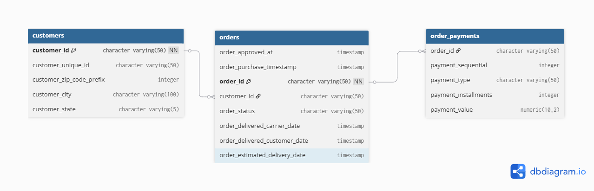

# 🛒 E-Commerce Relational Database & SQL Analytics Pipeline

### 🌐 [Click Here to View the Interactive Tableau Dashboard](https://public.tableau.com/app/profile/sumanth.sumanth4935/viz/OlistE-CommerceAnalytics_/Dashboard1)

An end-to-end data analytics project utilizing **PostgreSQL** to model, ingest, and query over 100,000 real-world e-commerce transactions. This project investigates customer ordering behavior, logistical delivery performance, and month-over-month revenue growth to extract actionable business intelligence.

---

## 🗄️ Database Architecture
To handle the multi-table relational structure of the Olist dataset, a PostgreSQL database was designed from scratch with enforced Primary and Foreign Key constraints to maintain data integrity.

---

## 📊 Key Business Insights & Analytical Queries

The project utilizes advanced SQL techniques (CTEs, Window Functions, and complex date math) to answer core executive-level questions:

### 1. The Black Friday Seasonality Spike (Month-over-Month Growth)
*   **The Finding:** Uncovered an extreme surge in order volume during **November 2017**, followed by an immediate sharp drop in December. 
*   **The Business Impact:** Proves that customer behavior is heavily distorted by promotional events like Black Friday, requiring leadership to track **Year-over-Year (YoY)** growth rather than Month-over-Month metrics to accurately measure baseline business health.

### 2. Regional Order Concentration
*   **The Finding:** The state of **São Paulo (SP)** overwhelmingly dominates total transaction volume, outperforming all other Brazilian states combined.
*   **The Business Impact:** Supply chain and inventory fulfillment hubs should be heavily prioritized and scaled within the São Paulo region to minimize transit costs.

### 3. Logistical Bottlenecks & Delivery Delays
*   **The Finding:** Calculated exact order-to-delivery durations by region using timestamp data extraction, revealing that northern and remote states suffer from significantly longer shipping latencies compared to the southeast corridor.

---

## 🛠️ Technical Skills Demonstrated
*   **Database Setup & DDL:** Designing relational schemas with strict Primary and Foreign Key constraints.
*   **Data Ingestion:** Utilizing pgAdmin 4 and PostgreSQL data import pipelines to ingest raw multi-table CSV files.
*   **Advanced SQL Querying:** 
    *   **Common Table Expressions (CTEs)** for modular, readable query construction.
    *   **Window Functions (`LAG()`, `OVER()`)** for sequential trend analysis.
    *   **Date/Time Manipulation (`EXTRACT(EPOCH ...)`, `DATE_TRUNC`)** for logistical timeline calculations.

---

## 📂 Repository Contents
*   `olist_business_analytics.sql`: The master SQL script containing all architectural schema creation and analytical queries.
*   `database_schema.png`: The Entity-Relationship Diagram (ERD) mapping table relationships.

---
*Built by [SUMANTH RAJAMAHANTHI]*
